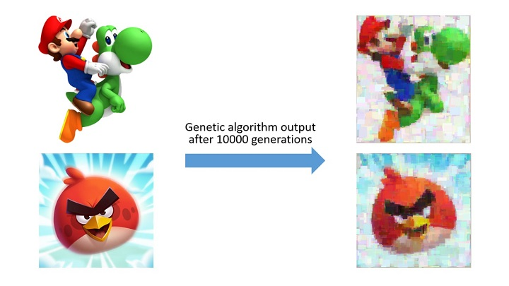
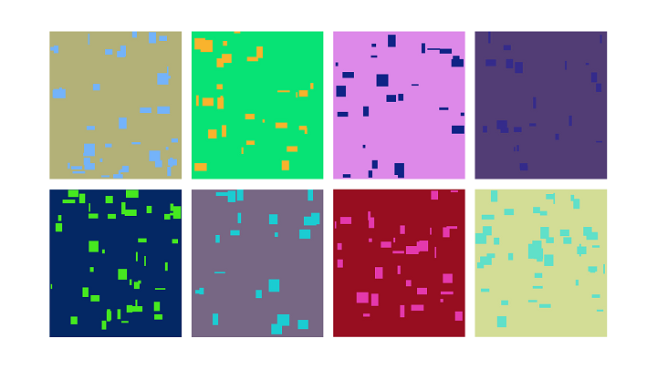

# Image Recreation by Genetic Algorithm

## Initial Population

Each Individual is an image with size of target image. When a random individual is created, it is given a random background color. Then, a random number of rectangular blocks with a random size of a specific random color for each individual is added to that background.

## Fitness Function

A relatively straightforward implementation for the fitness function is pixel-wise Mean Square Error (MSE) between two images. It may sound so strict to use this parameter because of its sensitivity to small differences which are not recognizable in Human Visual System (HVS) but actually, it works fine in practice.

## Selection

The tournament selection method is implemented to pick up the best individuals as parents for the next generation and then for crossover operation. It randomly samples the population given a tournament size and selects the fittest individual to be the winner of the tournament. In practice, a tournament size between 6-8% of the total population size would be a reasonable choice.

## Crossover

For crossover operation, it is used two different approaches which could help the diversity of the population. Both of these operations in one generation are used for creating the child which each has a probability of choosing.

## Blending Crossover

In this method, a random uniformly distributed variable $x \in [0, 1]$ is generated and the child is overlayed of a first parent with opacity $x$ and the second parent with opacity $1-x$.

## Two Point Crossover

In this approach, two random points on the row and column are selected to be the crossover points. These two points divide the individual into four areas. In areas 1 and 4, the first parent, and in areas 2 and 3, the second parent will be placed without any further changes
